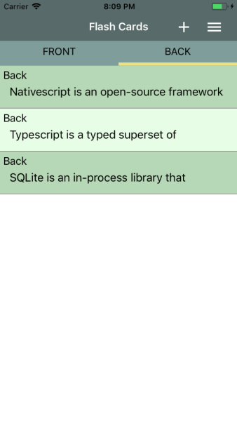
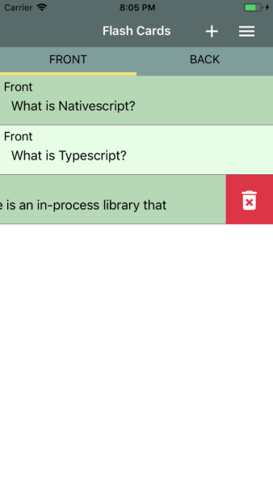
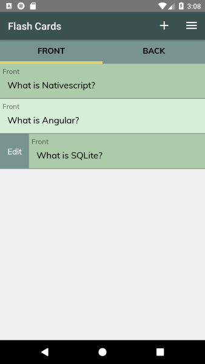
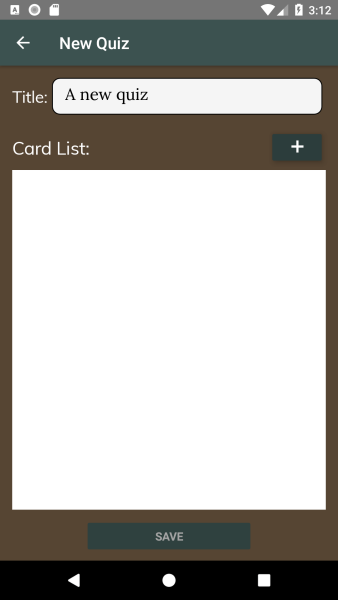
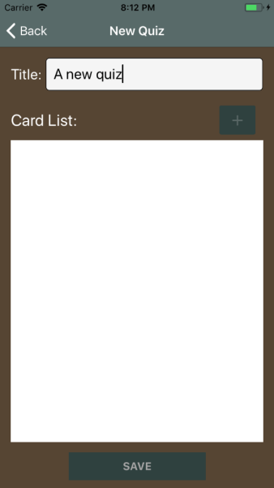
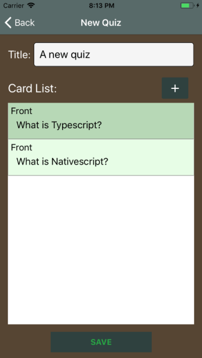
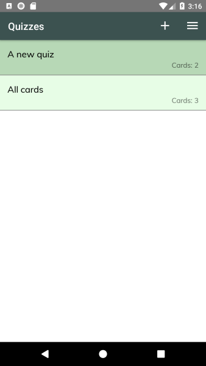
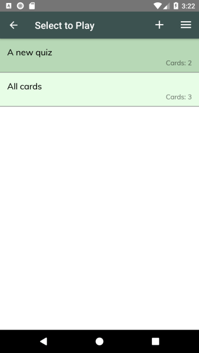
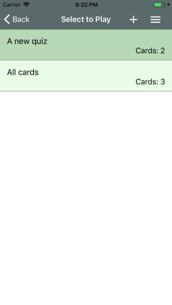

# Fish Memory App (Nativescript + Angular)
This project was generated with [Nativescript](https://www.nativescript.org/) version 3.4.3

This repo is part of the tiny project/portfolio for a **Super Simple Flash Card Management App**.

Unfortunately, I cannot make a live demo of this project as it is a native app for android and ios.

This app provides simple CRUDs for flash cards (only texts) and quizzes (group of cards). It also has a feature to play a quiz to check how good you are doing with your cramming at your exams : )

## How To Install And Run
Assuming you already followed the instructions at https://docs.nativescript.org/angular/start/quick-setup.

1. Clone this repo
2. Install dependent modules
3. Run `tns run ios` for iOS platform or `tns run android` for android platform.

## Screenshots
### 1. Creating Cards

    <figure style="width:50%;">
        
        <figcaption style="text-align:center;">Android - Creating Card</figcaption>
    </figure>
    <figure style="width:50%;">
        
        <figcaption style="text-align:center;">iOS - Creating Card</figcaption>
    </figure>

### 2. Card List

    <figure style="width:50%;">
        
        <figcaption style="text-align:center;">Android - Card List</figcaption>
    </figure>
    <figure style="width:50%;">
        
        <figcaption style="text-align:center;">iOS - Card List</figcaption>
    </figure>

    <figure style="width:50%;">
        
        <figcaption style="text-align:center;">Android - Card List (back)</figcaption>
    </figure>
    <figure style="width:50%;">
        
        <figcaption style="text-align:center;">iOS - Card List (back)</figcaption>
    </figure>

    <figure style="width:50%;">
        
        <figcaption style="text-align:center;">Android - Remove Card</figcaption>
    </figure>
    <figure style="width:50%;">
        
        <figcaption style="text-align:center;">iOS - Remove Card</figcaption>
    </figure>

    <figure style="width:50%;">
        
        <figcaption style="text-align:center;">Android - Edit Card</figcaption>
    </figure>
    <figure style="width:50%;">
        
        <figcaption style="text-align:center;">iOS - Edit Card</figcaption>
    </figure>

### 3. Creating Quizzes

    <figure style="width:50%;">
        
        <figcaption style="text-align:center;">Android - Create Quiz 1</figcaption>
    </figure>
    <figure style="width:50%;">
        
        <figcaption style="text-align:center;">iOS - Create Quiz 1</figcaption>
    </figure>

    <figure style="width:50%;">
        
        <figcaption style="text-align:center;">Android - Create Quiz 2</figcaption>
    </figure>
    <figure style="width:50%;">
        
        <figcaption style="text-align:center;">iOS - Create Quiz 2</figcaption>
    </figure>

    <figure style="width:50%;">
        
        <figcaption style="text-align:center;">Android - Create Quiz 3</figcaption>
    </figure>
    <figure style="width:50%;">
        
        <figcaption style="text-align:center;">iOS - Create Quiz 3</figcaption>
    </figure>

### 4. Quiz List

    <figure style="width:50%;">
        
        <figcaption style="text-align:center;">Android - Quiz List</figcaption>
    </figure>
    <figure style="width:50%;">
        
        <figcaption style="text-align:center;">iOS - Quiz List</figcaption>
    </figure>

### 5. Play Quiz

    <figure style="width:50%;">
        
        <figcaption style="text-align:center;">Android - Play Quiz 1</figcaption>
    </figure>
    <figure style="width:50%;">
        
        <figcaption style="text-align:center;">iOS - Play Quiz 1</figcaption>
    </figure>

    <figure style="width:50%;">
        
        <figcaption style="text-align:center;">Android - Play Quiz 2</figcaption>
    </figure>
    <figure style="width:50%;">
        
        <figcaption style="text-align:center;">iOS - Play Quiz 2</figcaption>
    </figure>

    <figure style="width:50%;">
        
        <figcaption style="text-align:center;">Android - Play Quiz 3</figcaption>
    </figure>
    <figure style="width:50%;">
        
        <figcaption style="text-align:center;">iOS - Play Quiz 3</figcaption>
    </figure>

